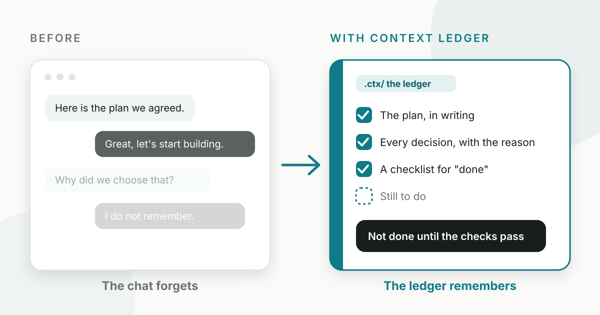
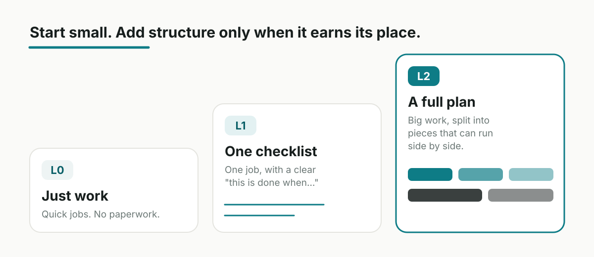
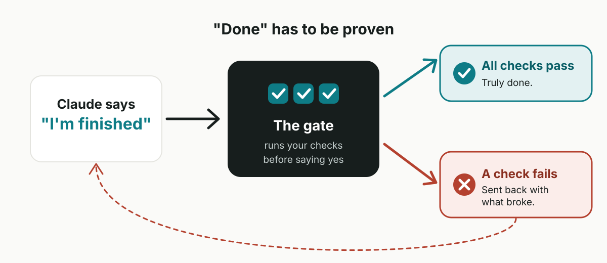
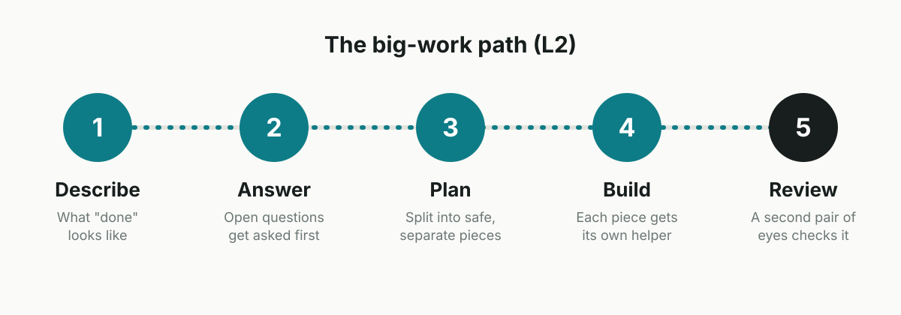

# Context Ledger: giving Claude a memory that lasts



If you have worked with an AI assistant for more than an hour, you have probably felt this. You agree on a plan, you make progress, and then the chat gets long, the assistant loses the thread, and you are explaining everything again. Worse, it sometimes announces "all done!" when it clearly is not.

**Context Ledger** is a small free add-on for Claude Code (Anthropic's coding assistant) that I built to fix both problems. In one sentence: it keeps the important things in **ordinary files** instead of in the chat, and it will not let Claude say "finished" until your checks actually pass.

## The problem, in plain words

Think of a chat as a whiteboard that gets wiped every so often. Anything written only there is temporary. Three things kept going wrong for me.

- **"Done" meant whatever Claude said it meant.** If the goal is "make it work properly", nobody can prove it failed, so nobody can prove it succeeded.
- **Helpers stepped on each other.** When a big job is split between several AI helpers, two of them would quietly change the same thing.
- **Decisions vanished.** Six weeks later I would argue the same point again, because the reason for the choice lived in a chat that no longer existed.

All three are really memory problems. So the fix is a notebook, not a smarter assistant.

## The idea: a notebook that stays

Context Ledger creates a folder called `.ctx/` in your project. Inside are plain text files: the plan, the decisions you made and why, and the checklist for "done". You can open them, read them, edit them, and share them with teammates like any other file.

Because they are files, a long chat no longer matters. Close the session, start a fresh one next week, and Claude reads the notebook and carries on where you left off.

## Pick how much process you need

Nobody wants a form to fill in for a two-minute fix. So Context Ledger has three levels, and the default is "nothing at all".



| Level                 | What it is                          | Use it when                                           |
| --------------------- | ----------------------------------- | ----------------------------------------------------- |
| **L0, just work**     | Nothing extra. Quietly keeps a log. | Anything you would finish in one sitting.             |
| **L1, one checklist** | A single task with a "done" list.   | One change where you can describe what "done" means.  |
| **L2, a full plan**   | A written plan split into pieces.   | Big work with parts that can safely run side by side. |

The common mistake is reaching for L2 too early. If a written plan for a small fix sounds silly, it is: stay at L0. You can drop back down at any time with `/ctx:drop`, and nothing is deleted.

## The part I like most: "done" has to be proven

At level L1 and above, every task carries a short checklist, and at least one item is a check the computer can run, such as "the tests pass". When Claude tries to wrap up, a gate runs that check.



If everything passes, the work is truly done. If something fails, Claude is sent back with exactly what broke. And it will not loop forever: after three failed attempts the gate stops and asks Claude to explain what is going on instead.

## Bigger jobs: from idea to finished

For large pieces of work, there is a path with five steps. Each is one short command you type, and Claude does the heavy lifting.



1. **Describe.** Say what you want. Claude writes down what "done" looks like and what is out of scope.
2. **Answer.** Anything unclear becomes a question you must answer. The plan will not start until you have. That refusal is deliberate: it makes the awkward questions come up before any work is done.
3. **Plan.** The job is split into small pieces. Each piece lists the files it may change, so two helpers can never collide.
4. **Build.** Each piece goes to its own helper, who sees only its own instructions.
5. **Review.** A separate reviewer checks the result. It never watched the work being done, so it cannot mark its own homework.

There is even a command, `/ctx:preview`, that turns the plan into one readable page, so someone who does not write code can read it and say "yes, that is what I meant".

## Install it in two commands

You need Claude Code. Then, inside a Claude Code session, run:

```text
/plugin marketplace add ansh-n-chovatiya/context-ledger
/plugin install ctx@context-ledger
```

Prefer a regular terminal? These do the same thing:

```bash
claude plugin marketplace add ansh-n-chovatiya/context-ledger
claude plugin install ctx@context-ledger
```

Then, in any project, type this once:

```text
/ctx:init
```

That is the whole setup. It creates the `.ctx/` folder and stays quiet until you ask for more. It uses only Python, which already comes with macOS and Linux, so nothing is added to your project.

The full source, a plain-language guide and the complete command list are in the [Context Ledger repository on GitHub](https://github.com/ansh-n-chovatiya/context-ledger).

## The commands you will actually use

| Command        | What it does                                  |
| -------------- | --------------------------------------------- |
| `/ctx:init`    | Set up the notebook in a project, once.       |
| `/ctx:task`    | Start a single checklist (level L1).          |
| `/ctx:spec`    | Begin a big piece of work (level L2).         |
| `/ctx:status`  | Show where things stand.                      |
| `/ctx:resume`  | Pick up after a break.                        |
| `/ctx:next`    | Suggest the single most useful next step.     |
| `/ctx:decide`  | Write down a decision and the reason.         |
| `/ctx:handoff` | Summarise the work so someone else can start. |

## Honest limits

It is more process than most small changes deserve, and the tool cannot stop me from using the big plan when a checklist would do. That one takes discipline, not code.

The gate is also only as good as the checks you give it. A check that passes for the wrong reason gives a green light that means nothing, and writing a good check takes real effort. Some things need judgement rather than a test, and those go to a reviewer, which is an AI checking an AI.

If I did it again, I would read the plan preview every single time. Spotting a wrong plan on one page is far cheaper than finding it halfway through the work.

## In short

None of this is clever. It is files, a few small safety checks, and a refusal to accept "done" without proof. But the plan now survives the session, every piece has clear boundaries, and when Claude says it is finished, there is evidence.
